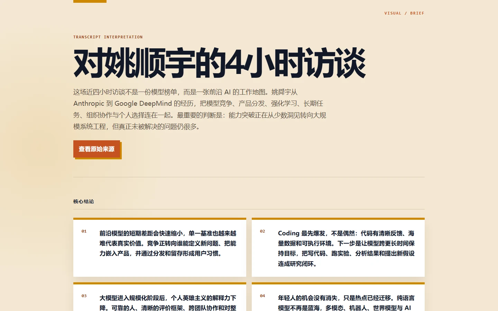

# Podcast to Summary Text Skill

This repository publishes the `mimo-token-plan-asr-llm-pipeline` skill.

The installable skill folder is:

```text
mimo-token-plan-asr-llm-pipeline/
  SKILL.md
  scripts/
  references/
```

The root documentation files are for GitHub only. Do not copy them into the skill folder unless your AI IDE explicitly asks for them.

## What This Skill Does

This skill helps an AI coding agent turn podcasts, videos, URLs, or existing transcripts into a transcript, a timestamped deep-summary Markdown report, and a fully offline HTML visual brief.

By default, an audio or video run must deliver all three artifacts: `<base>_转写.txt`, `<base>_逐窗口深度解读.md`, and `<base>_图文速览.html`. The bundle is reduced to a transcript only when the user explicitly asks for transcription without summary.

It is designed for long-form audio and video content. The final report contains:

- timestamped timeline sections
- one report section for each ASR transcript window
- LLM proofreading before summary: punctuation, sentence boundaries, typos, English terms, person names, and company names
- concise explanations of what each segment discussed
- short direct quotes only when supported by transcript text
- a transcription note
- a final core ideas table for quick scanning
- a VisualBriefManifest v2 HTML interpretation with a one-line overview, core insights, developer takeaways, critical thinking, and further questions
- developer takeaways covering RAG/context engineering, model training/data, Agent construction/reliability, and an Agent-development learning path

The default report style is a strict timeline report:

```markdown
# Title

> Transcription note...

## 00:00-00:03 Opening topic

## 00:03-00:06 Next topic

## Core Ideas At A Glance

| Time | Section | Core Idea | Evidence / Quote |
```

## Live Demo

This is a complete real-world output generated by the skill from a nearly four-hour Bilibili interview with Yao Shunyu. The repository preserves the calibrated transcript, the window-by-window analysis, and the final HTML visual interpretation.

[Read the calibrated transcript](examples/yao-shunyu-interview/calibrated-transcript.txt) · [Read the window-by-window analysis](examples/yao-shunyu-interview/window-by-window-analysis.md) · [Open the live HTML visual brief](https://wsh-dot.github.io/podcast-to-summary-text/) · [View the self-contained HTML](docs/index.html) · [Watch the source video](https://www.bilibili.com/video/BV1YR5E6EE9o)



The run preserved all 77 calibrated transcript windows across 3 hours 48 minutes, produced a Markdown analysis covering every window, and only then condensed both sources into a 5–7 minute HTML interpretation with five themes, four core insights, and eight renderer-owned CSS/SVG infographics. The HTML does not embed the full transcript or frames from the source video, and it has no external script or image dependencies; the complete transcript and analysis remain available as separate repository artifacts.

## Supported Inputs

- Local audio: `.mp3`, `.wav`, `.m4a`, `.flac`, `.ogg`, `.aac`
- Local video: `.mp4`, `.mkv`, `.avi`, `.mov`, `.webm`, `.flv`
- Bilibili URLs, exclusively through BBDown with pinned version 1.6.3 downloaded and verified on first use
- Other URLs supported by `yt-dlp`, including Xiaoyuzhou podcast pages and YouTube links
- Existing transcripts with `[HH:MM-HH:MM]` windows

## Proofreading And Summary Modes

The skill separates ASR transcription, LLM proofreading, and LLM summary generation. Raw ASR often lacks punctuation and contains typos, broken English terms, and misrecognized names, so the default flow proofreads before summarizing.

Audio, video, and URL inputs require a resolvable ASR credential. The script checks explicit arguments, environment variables, then the user-local cache; it asks the user only when all three are absent. LLM credentials are optional.

The agent should ask one question at a time at task start:

1. Which ASR source should be used?
2. After the ASR answer is recorded, which proofreading/summary mode should be used?

Proofreading/summary modes:

- `ide-agent`: use the current IDE/Agent model to proofread ASR first, then summarize; the script merges and validates. This is the recommended default.
- `api-llm`: use an API LLM provider such as MiMo, Kimi, Zhipu, Alibaba, Tencent, MiniMax, or an OpenAI-compatible endpoint to proofread and summarize automatically.
- `manual`: export prompts and let the user paste model outputs manually for proofreading and summary.

API LLM mode now pipelines proofreading -> immediate summary per batch with bounded concurrency of 2. Use `--proofread-mode inline` when only the final report is needed; calibrated inputs skip duplicate proofreading automatically. Set `--llm-concurrency 1` for strict provider rate limits.

## Installation

### Quick Install In AI IDEs

If CodeBuddy, Qoder Work, Codex, or another AI coding IDE supports installing a skill from GitHub, paste this **skill subdirectory URL**:

```text
https://github.com/wsh-dot/podcast-to-summary-text/tree/main/mimo-token-plan-asr-llm-pipeline
```

You can also send this prompt to your AI IDE:

```text
Install the skill from this GitHub subdirectory:
https://github.com/wsh-dot/podcast-to-summary-text/tree/main/mimo-token-plan-asr-llm-pipeline

Install only the mimo-token-plan-asr-llm-pipeline/ directory. The installed skill root must directly contain SKILL.md, scripts/, and references/.
Do not copy the repository root README.md, README.en.md, or README.zh.md files into the installed skill folder.
```

Do not rely on the repository root URL `https://github.com/wsh-dot/podcast-to-summary-text` as an automatic install URL. The repository root is documentation only, while the actual skill is in a subdirectory. Strict installers that only look for `SKILL.md` at the repository root may fail.

If your AI IDE cannot install from a GitHub subdirectory, use the manual steps below.

Clone this repository:

```bash
git clone https://github.com/wsh-dot/podcast-to-summary-text.git
```

### Install For Codex Skills

Windows PowerShell:

```powershell
mkdir "$env:USERPROFILE\.codex\skills" -Force
Copy-Item -Recurse ".\podcast-to-summary-text\mimo-token-plan-asr-llm-pipeline" "$env:USERPROFILE\.codex\skills\mimo-token-plan-asr-llm-pipeline"
```

macOS / Linux:

```bash
mkdir -p ~/.codex/skills
cp -R ./podcast-to-summary-text/mimo-token-plan-asr-llm-pipeline ~/.codex/skills/
```

### Install For Qoder Work Skills

Windows PowerShell:

```powershell
mkdir "$env:USERPROFILE\.qoderworkcn\skills" -Force
Copy-Item -Recurse ".\podcast-to-summary-text\mimo-token-plan-asr-llm-pipeline" "$env:USERPROFILE\.qoderworkcn\skills\mimo-token-plan-asr-llm-pipeline"
```

For other AI IDEs, copy the `mimo-token-plan-asr-llm-pipeline/` folder into the IDE's skills directory.

## Dependencies

Python packages:

```bash
pip install openai yt-dlp
```

System dependency:

```bash
ffmpeg
```

Windows:

```powershell
winget install Gyan.FFmpeg
```

Tencent ASR support also requires:

```bash
pip install tencentcloud-sdk-python
```

## ASR Credentials

Choose one ASR source:

| ASR source | Credential |
|---|---|
| MiMo ASR | `--api-key`, `--asr-api-key`, or `MIMO_API_KEY` |
| Alibaba Qwen ASR | `--asr-provider aliyun-qwen --asr-api-key`, `DASHSCOPE_API_KEY`, or `ALIYUN_API_KEY` |
| Alibaba Fun-ASR-Flash | `--asr-provider aliyun-funasr-flash --asr-api-key`, `DASHSCOPE_API_KEY`, or `ALIYUN_API_KEY` |
| StepFun ASR | `--asr-provider stepfun --asr-api-key`, `STEPFUN_API_KEY`, or `STEP_API_KEY`; add `--stepfun-plan` for Step Plan credits |
| Tencent ASR | `--asr-provider tencent --tencent-secret-id --tencent-secret-key` |
| Existing transcript | No ASR API credential; use `--transcript-input` |

Do not commit API keys, cookies, browser profiles, or exported credentials.

### Persistent ASR credentials across conversations

After a credential supplied through an argument or environment variable completes a real ASR transcription successfully, the script saves it in the user-local configuration. New conversations can omit the credential:

```bash
python scripts/mimo_podcast_tool.py input.mp3 --transcribe-only --api-key "tp-xxxx"
# Later conversations
python scripts/mimo_podcast_tool.py input.mp3 --transcribe-only
```

Default locations:

- Windows: `%APPDATA%\mimo-podcast-tool\asr-credentials.json`
- macOS: `~/Library/Application Support/mimo-podcast-tool/asr-credentials.json`
- Linux: `${XDG_CONFIG_HOME:-~/.config}/mimo-podcast-tool/asr-credentials.json`

A cached credential rejected with 401/403 or an explicit authentication error is removed only for that provider, after which the agent requests a replacement. Rate limits, network failures, and server errors retain the cache. To clear one manually:

```bash
python scripts/mimo_podcast_tool.py --forget-asr-credentials --asr-provider mimo
```

## Common Commands

Run commands from the skill directory:

```bash
cd podcast-to-summary-text/mimo-token-plan-asr-llm-pipeline
```

MiMo ASR, then IDE/Agent proofreading and summary:

```bash
python scripts/mimo_podcast_tool.py input.mp3 --transcribe-only --api-key "tp-xxxx"
python scripts/mimo_podcast_tool.py --transcript-input input_转写.txt --manual-sections-dir input_agent_sections
```

Alibaba Qwen ASR, then IDE/Agent proofreading and summary:

```bash
python scripts/mimo_podcast_tool.py input.mp3 --transcribe-only --asr-provider aliyun-qwen --asr-api-key "sk-xxxx"
python scripts/mimo_podcast_tool.py --transcript-input input_转写.txt --manual-sections-dir input_agent_sections
```

Alibaba Fun-ASR-Flash, then IDE/Agent proofreading and summary:

```bash
python scripts/mimo_podcast_tool.py input.mp3 --transcribe-only --asr-provider aliyun-funasr-flash --asr-api-key "sk-xxxx"
python scripts/mimo_podcast_tool.py --transcript-input input_转写.txt --manual-sections-dir input_agent_sections
```

The default model is `fun-asr-flash-2026-06-15`, called through DashScope's native non-streaming `multimodal-generation` API. Default 3-minute chunks stay below the model's 5-minute limit.

StepFun StepAudio 2.5 ASR using Step Plan subscription credits:

```bash
python scripts/mimo_podcast_tool.py input.mp3 --transcribe-only --asr-provider stepfun --stepfun-plan --asr-api-key "..."
python scripts/mimo_podcast_tool.py --transcript-input input_转写.txt --manual-sections-dir input_agent_sections
```

Without `--stepfun-plan`, the standard platform `/v1` path is used. The script never falls back between the two billing paths.

Existing transcript, then API LLM proofreading and summary:

```bash
python scripts/mimo_podcast_tool.py --transcript-input input_转写.txt --llm-provider kimi --llm-api-key "sk-xxxx"
```

Manual prompt export:

```bash
python scripts/mimo_podcast_tool.py --transcript-input input_转写.txt --export-ide-prompts
python scripts/mimo_podcast_tool.py --transcript-input input_转写.txt --manual-sections-dir input_ide_prompts/sections
```

## URL And Cookie Notes

Bilibili URLs always use BBDown and never fall back to `yt-dlp`. On first use the script downloads and verifies pinned version 1.6.3; use `--bbdown-path` or `BBDOWN_PATH` for an existing executable. Xiaoyuzhou, YouTube, and other ordinary URLs continue to use `yt-dlp`.

For Bilibili content requiring login state:

```bash
python scripts/mimo_podcast_tool.py "https://www.bilibili.com/video/BV..." --transcribe-only --api-key "tp-xxxx" --bilibili-cookie "SESSDATA=..."
```

Pass `--no-bbdown-auto-install` to disable automatic installation; a BBDown path is then required.

Cookies are sensitive credentials. Do not print them, store them in reports, or commit them.

## Verification

Run:

```bash
python scripts/mimo_podcast_tool.py --self-test
python -m compileall -q scripts
python scripts/mimo_podcast_tool.py --help
```

The self-test does not call any external API.

This release also passed:

- `python -m unittest discover -s tests -v`: 114 tests
- skill-judge: `116/120 (A)`
- SkillOpt skillquality gate: `hard=1.0000`, `soft=1.0000` (17/17)
